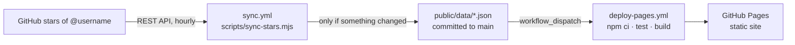

<div align="center">

# ⭐ GitStar

**Your starred repos, with a point of view.**

A static, bilingual (English / العربية, RTL) shelf for your public GitHub stars.
Fork it, set your username, let GitHub Actions keep it fresh every hour.

[](https://github.com/mrx7014/GitStar/actions/workflows/sync.yml)
[](https://github.com/mrx7014/GitStar/actions/workflows/deploy-pages.yml)
[](https://github.com/mrx7014/GitStar/actions/workflows/ci.yml)
[](LICENSE)

[Live site](https://mrx7014.github.io/GitStar/) · [التوثيق العربي](docs/README.ar.md) · [Changelog](CHANGELOG.md) · [Issues](https://github.com/mrx7014/GitStar/issues)

</div>

---

## What it is

GitHub's Stars page is a flat list that is hard to search and revisit. GitStar turns it into a categorized, searchable directory:

- **No backend, no database, no secrets.** A Node script reads the public GitHub API, writes JSON into the repo, and a static React site renders it.
- **Everything runs on GitHub Actions** (sync + build + deploy). You never run a server.
- **Failure-safe.** If GitHub rate-limits a sync, the last good snapshot stays on the site and a banner explains what happened.

## How it works



1. **`sync.yml`** runs at minute 17 of every hour (and on demand). It calls `GET /users/{username}/starred` with the `star+json` media type (this is what returns the real `starred_at` date), follows `Link` pagination, retries transient errors, and classifies every repo into a category.
2. The script compares a SHA-256 hash of the result with the previous one. **If nothing changed, nothing is committed**, so your history stays clean.
3. If data changed, it commits `public/data/` to `main` and **explicitly triggers `deploy-pages.yml`** (pushes made with `GITHUB_TOKEN` do not trigger other workflows on their own).
4. **`deploy-pages.yml`** installs dependencies, runs the tests, builds with Vite (using the correct Pages base path), and publishes `dist/` to GitHub Pages.
5. **`ci.yml`** runs tests and a build on every pull request / non-`main` push.

## Quick start (about 5 minutes)

### 1. Create your copy

Click **Use this template** (recommended) or **Fork**.

> Note: a fork of a public repository is always public. If you want an independent repo, use the template.

### 2. Tell it whose stars to show

Pick **one** of these (highest priority first):

| Method | Where | When to use |
|---|---|---|
| Repository variable `GITSTAR_USERNAME` | *Settings → Secrets and variables → Actions → Variables* | Easiest, no code change |
| `githubUsername` in `src/config.js` | the file in your repo | You prefer config in code |
| Automatic fallback | none | If both are empty/`demo`, the repository **owner** is used |

```js
// src/config.js
export const siteConfig = {
  githubUsername: 'your-github-username',
  siteName: 'My Star Shelf',
  defaultLanguage: 'en', // 'en' | 'ar'
}
```

> GitHub does not allow repository variable names that start with `GITHUB_`, which is why the variable is called `GITSTAR_USERNAME`.

### 3. Enable GitHub Actions

New forks/templates have workflows disabled by default. Open the **Actions** tab and click **I understand my workflows, go ahead and enable them**.

Then go to **Settings → Actions → General → Workflow permissions** and choose **Read and write permissions**. (The sync job needs this to commit the JSON files.)

### 4. Turn on GitHub Pages

**Settings → Pages → Build and deployment → Source: GitHub Actions.**

### 5. Run the first sync

**Actions → Sync GitHub Stars → Run workflow.**

The job fetches your stars, commits `public/data/*.json`, and triggers the deploy. When *Deploy GitStar to Pages* turns green, your site is live at:

```
https://<your-username>.github.io/<repo-name>/
```

From now on it refreshes itself every hour. You do not need to touch anything else.

## Configuration

`src/config.js` (all keys optional except the username):

| Key | Default | Description |
|---|---|---|
| `githubUsername` | `'demo'` | Whose public stars to show. Overridden by `GITSTAR_USERNAME`. |
| `siteName` | `'GitStar'` | Name shown in the header and page title. |
| `defaultLanguage` | `'en'` | Initial UI language: `'en'` or `'ar'`. Visitors can switch; their choice is remembered. |
| `tagline`, `bio` | built-in | Short copy under the title. |
| `pinnedRepos` | `[]` | `['owner/repo']` shown first in "Start here". Empty = your 6 newest stars. |
| `featuredRepos` | `[]` | `['owner/repo']` highlighted with a badge. |
| `manualCategories` | `{}` | Force a category: `{ 'owner/repo': 'android-modding' }`. |
| `categories` | `undefined` | Optional extra/override category rules. |
| `showArchived` | `true` | Allow archived repos to appear. |
| `repoUrl` | this repo | "View source" link. Set it to your own repo. |
| `staleAfterHours` | `6` | After this long without a successful sync, the UI shows a "stale" indicator. |

### Repository variables (Settings → Variables → Actions)

| Variable | Default | Description |
|---|---|---|
| `GITSTAR_USERNAME` | owner / config | Username to sync. |
| `GITSTAR_KEEPALIVE` | on | Set to `false` to disable the monthly keep-alive commit. |

### Categories

Repos are scored per category from whole-word matches: **topics = 5, name = 3, language = 2, description = 1**. The best score wins, a minimum score of 3 is required, otherwise the repo goes to **Other**. Built-in categories: AI & ML, Web & Frontend, Developer Tools, Backend & Data, Mobile, Android Modding, Linux & Shell, Security, DevOps & Self-hosting, Design & Creative, Learning Resources, Other.

Fix one repo by hand with `manualCategories`, or add a rule in `src/category-engine.js` so it applies to every future sync.

## Data files

Everything the site shows lives in `public/data/`:

| File | Content |
|---|---|
| `repos.json` | Compact list of repos: name, owner, description, language, topics, stars, forks, `starred_at`, `pushed_at`, category, archived. |
| `meta.json` | Username, repo count, content hash, last real change (`syncedAt`), last check (`checkedAt`). |
| `status.json` | `ok`, `rate_limited` or `error`, plus message and timestamps. A failed sync only updates this file. |
| `history.json` | Up to 500 "added / removed" events shown on the **Changes** page. |

A fresh template ships with a tiny **sample dataset** (`username: demo`) so the UI is not empty before your first sync. Your first successful sync replaces it.

## Local development

Requirements: Node.js 20+ (Node 22 is what CI uses).

```bash
git clone https://github.com/<you>/GitStar.git && cd GitStar
npm ci
GITSTAR_USERNAME=your-username npm run sync   # optional: fetch real data
npm run dev                                   # http://localhost:3000
```

| Script | What it does |
|---|---|
| `npm run dev` | Vite dev server on port 3000. |
| `npm run build` | Production build into `dist/`. |
| `npm run preview` | Serve the built site. |
| `npm run sync` | Fetch stars and write `public/data/*.json`. |
| `npm test` | Sync classifier tests + category engine tests. |

For local syncs a token raises the API limit (60 → 5,000 requests/hour). Put it in your shell, never in a file you commit:

```bash
GITHUB_TOKEN=ghp_xxx npm run sync
```

See `.env.example` for the variable names.

## Other hosts

The output is plain static files, so any host works: run `npm run build` and publish `dist/`.

- **Vercel / Netlify / Cloudflare Pages:** build command `npm run build`, output directory `dist`. Keep the **sync** workflow on GitHub; each data commit redeploys the site on those platforms automatically.
- **Project pages base path:** `deploy-pages.yml` passes `VITE_BASE_PATH` for you. For other sub-path hosting, set `VITE_BASE_PATH=/my-subpath/` at build time.

## Troubleshooting

| Symptom | Cause / fix |
|---|---|
| Site shows sample repos (`demo`) | The first sync has not run, or the username is not set. Set `GITSTAR_USERNAME` (or `githubUsername`) and run **Sync GitHub Stars**. |
| Shows someone else's stars | `githubUsername` still points to another account. |
| Sync job is red: *push rejected* | Settings → Actions → General → Workflow permissions → **Read and write**. |
| Nothing happens hourly | Actions are disabled on the copy, or GitHub paused schedules after 60 days of no activity. Re-enable in the Actions tab. The monthly keep-alive commit prevents the second case. |
| Data updated but site is old | Settings → Pages → Source must be **GitHub Actions**; check the *Deploy* run. |
| 404 on Pages | Same as above, then re-run *Deploy GitStar to Pages*. |
| Banner says *rate limited* | GitHub API limit hit. The old data stays online; the next hourly run recovers it. |
| Missing stars | Only **public** stars are returned by the API. |
| Wrong dates | Needs the `star+json` media type, which the sync script already sends. Re-run the sync. |

## Project structure

```
.
├── .github/
│   ├── workflows/{sync,deploy-pages,ci}.yml
│   ├── ISSUE_TEMPLATE/  PULL_REQUEST_TEMPLATE.md  CODEOWNERS  dependabot.yml
├── docs/                 # Arabic README, design notes
├── public/               # favicon, manifest, data/*.json
├── scripts/              # sync-stars.mjs, classify-test.mjs
├── src/                  # App.jsx, config.js, i18n.js, category-engine.js, styles.css
├── vite.config.js
└── package.json
```

## Contributing & security

See [CONTRIBUTING.md](CONTRIBUTING.md) and [SECURITY.md](SECURITY.md). When you change a visible label, update both English and Arabic strings in `src/i18n.js`.

## License

[MIT](LICENSE) © mrx7014
