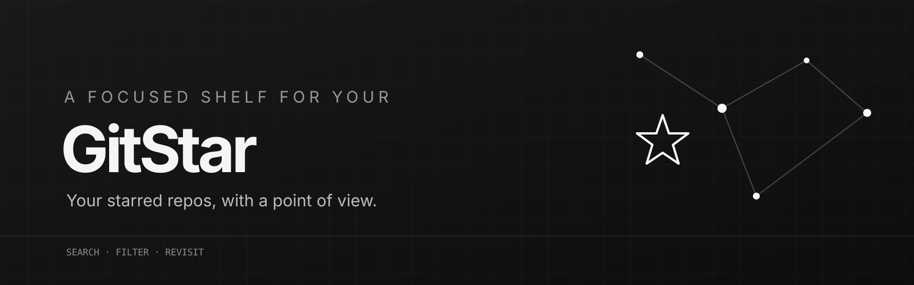
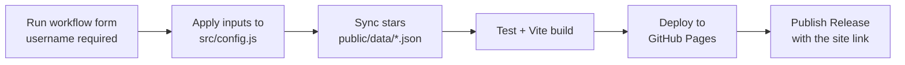

<div align="center">



# ⭐ GitStar

**Your starred repos, with a point of view.**

A static, bilingual (English / العربية, RTL) shelf for your public GitHub stars.
Fork it, run **one** GitHub Action, and your site is live.

[](https://github.com/mrx7014/GitStar/actions/workflows/build.yml)
[](LICENSE)

[Live site](https://mrx7014.github.io/GitStar/) · [التوثيق العربي](docs/README.ar.md) · [Changelog](CHANGELOG.md) · [Issues](https://github.com/mrx7014/GitStar/issues)

</div>
---

## What it is

GitHub's Stars page is a flat list that is hard to search and revisit. GitStar turns it into a categorized, searchable directory:

- **No backend, no database, no secrets.** A Node script reads the public GitHub API, writes JSON into the repo, and a static React site renders it.
- **One workflow does everything.** `build.yml` syncs your stars, tests, builds, deploys to GitHub Pages and publishes a Release with the live link.
- **Failure-safe.** If GitHub rate-limits a sync, the last good snapshot is used and the site shows a banner.

## How it works

You open **Actions → Build → Run workflow** and fill a short form. That is the only way to build and publish the site.



`.github/workflows/build.yml` has three jobs:

| Job | What it does |
|---|---|
| **Sync and build** | Checks Pages is enabled and the username exists, applies your form values to `src/config.js`, fetches your stars (`star+json` media type, `Link` pagination, retries), classifies every repo, runs the tests, commits the data (and config, if you keep *save_config* on), and builds the site. |
| **Deploy to GitHub Pages** | Publishes the build and records the live URL as the `github-pages` deployment. |
| **Publish release** | Creates a GitHub Release (tag `site-YYYY.MM.DD-runN`) whose notes contain the live site link, the username, repo count, sync status and commit. Turn it off with the *create_release* checkbox. |

If a repo is rate-limited during the sync, the build continues with the last good data and a warning is shown in the run.

## Quick start

### 1. Create your copy

Click **Use this template** (recommended) or **Fork**.

> A fork of a public repository is always public. Use the template if you want an independent repo.

### 2. Allow Actions and Pages (one time)

1. **Actions tab** → click **I understand my workflows, go ahead and enable them** (new copies start with workflows disabled).
2. **Settings → Actions → General → Workflow permissions** → **Read and write permissions** → Save. The build commits your data and creates the Release.
3. **Settings → Pages → Build and deployment → Source** → **GitHub Actions**.

If step 3 is missing, the workflow stops at its first step with a message telling you exactly this.

### 3. Run the Build workflow

**Actions → Build → Run workflow**, fill the form, press the green button.

| Field | Required | What to enter |
|---|:---:|---|
| `username` | **Yes** | The GitHub username whose public stars to show. Example: `mrx7014` |
| `site_name` | No | Site name. Empty keeps `config.js`. |
| `default_language` | No | `keep` / `en` / `ar`. First language shown to visitors. |
| `tagline` | No | Short line under the title. Empty keeps `config.js`. |
| `pinned_repos` | No | Repos shown first, e.g. `owner/repo, owner/repo2`. |
| `featured_repos` | No | Repos with a *Featured* badge. |
| `manual_categories` | No | Force a category: `owner/repo=security, owner/x=mobile`. |
| `stale_after_hours` | No | Hours before the site warns that data is old. Since builds are manual, `720` (30 days) is a good value. |
| `save_config` | No (on) | Commit the values you typed into `src/config.js`, so the next run remembers them. |
| `create_release` | No (on) | Publish a GitHub Release with the live link. |

Optional fields left empty **keep whatever is already in `src/config.js`**. Invalid values fail the run immediately with a clear error before anything is changed.

### 4. Open your site

When the run turns green, the link is in three places: the **Release** notes, the run **Summary**, and the **Deployments** box on the repo home page. It looks like:

```
https://<your-username>.github.io/<repo-name>/
```

To refresh your stars later, run **Build** again. Typing the username again is the only thing you must do.

## The config file

`src/config.js` is the single place for site settings. The form above edits it for you, but you can also edit it by hand and run **Build**. You still have to type `username` in the form each run (it must match the account you want).

| Key | Default | Description |
|---|---|---|
| `githubUsername` | — | Set by the `username` field. |
| `siteName` | `'GitStar'` | Header and page title. |
| `defaultLanguage` | `'en'` | `'en'` or `'ar'`. Visitors can switch; their choice is remembered. |
| `tagline`, `bio` | built-in | Short copy under the title. |
| `pinnedRepos` | `[]` | `['owner/repo']` shown first in "Start here". Empty = your 6 newest stars. |
| `featuredRepos` | `[]` | `['owner/repo']` with a badge. |
| `manualCategories` | `{}` | `{ 'owner/repo': 'android-modding' }`. |
| `categories` | `undefined` | Optional extra category rules. |
| `showArchived` | `true` | Allow archived repos to appear. |
| `repoUrl` | — | Set automatically to the repo running the workflow. |
| `staleAfterHours` | `6` | Freshness threshold for the "stale" banner. |

### Categories

Repos are scored per category from whole-word matches: **topics = 5, name = 3, language = 2, description = 1**. The best score wins; below 3 the repo goes to **other**. Valid ids: `ai-ml`, `web-frontend`, `developer-tools`, `backend-data`, `mobile`, `android-modding`, `linux-shell`, `security`, `devops-selfhost`, `design-creative`, `learning-resources`, `other`.

Fix one repo with `manual_categories` (or `manualCategories` in the config). Add a rule in `src/category-engine.js` for every future sync.

## Data files

Everything the site shows lives in `public/data/`:

| File | Content |
|---|---|
| `repos.json` | Compact list: name, owner, description, language, topics, stars, forks, `starred_at`, `pushed_at`, category, archived. |
| `meta.json` | Username, repo count, content hash, last real change (`syncedAt`), last check (`checkedAt`). |
| `status.json` | `ok`, `rate_limited` or `error`, with message and timestamps. A failed sync only updates this file. |
| `history.json` | Up to 500 added / removed events for the **Changes** page. |

## Local development

Requirements: Node.js 20+ (the workflow uses Node 22).

```bash
git clone https://github.com/<you>/GitStar.git && cd GitStar
npm ci
GITSTAR_USERNAME=your-username npm run sync   # optional: fetch real data
npm run dev                                   # http://localhost:3000
```

| Script | What it does |
|---|---|
| `npm run dev` | Vite dev server on port 3000. |
| `npm run build` | Production build into `dist/`. |
| `npm run preview` | Serve the built site. |
| `npm run sync` | Fetch stars into `public/data/*.json` (uses `GITSTAR_USERNAME`, else `githubUsername`). |
| `npm test` | Category, sync and workflow-input tests. |

A token raises the API limit for local syncs (60 → 5,000 requests/hour). Keep it in your shell, never in a committed file:

```bash
GITHUB_TOKEN=ghp_xxx npm run sync
```

## Troubleshooting

| Symptom | Cause / fix |
|---|---|
| Run fails at once: *GitHub Pages is not ready* | Settings → Pages → Source → **GitHub Actions**, then run again. |
| Run fails: *Unknown GitHub user* | The `username` has a typo or the account does not exist. |
| Run fails: *Invalid workflow input* | Read the message; it names the field and the accepted format. |
| *push rejected* in the commit step | Settings → Actions → General → Workflow permissions → **Read and write**. If `main` is protected, allow GitHub Actions to push or turn protection off for it. |
| No **Run workflow** button | Actions are disabled on your copy (enable them) or you are not on the default branch. |
| Warning: *Sync not fully successful* | GitHub rate limit or API error. The previous data is deployed; run Build again later. |
| Site says data is *stale* | Builds are manual. Run Build again, or raise `stale_after_hours`. |
| Missing stars | Only **public** stars are exposed by the GitHub API. |
| Release step fails | *Read and write* permissions are missing, or a tag with the same name exists (re-run). |

## Other hosts

The output is plain static files: run `npm run build` and publish `dist/` on Vercel, Netlify, Cloudflare Pages or any host (set `VITE_BASE_PATH` if it is served from a sub-path). Run the **Build** workflow on GitHub to refresh the data; the Pages deploy step needs Pages enabled.

## Project structure

```
.
├── .github/
│   ├── workflows/build.yml          # the one workflow: sync → test → build → deploy → release
│   ├── ISSUE_TEMPLATE/  PULL_REQUEST_TEMPLATE.md  CODEOWNERS  dependabot.yml
├── docs/                            # Arabic README, design notes
├── public/                          # favicon, manifest, og image, data/*.json
├── scripts/
│   ├── apply-inputs.mjs             # form inputs → src/config.js (validated)
│   ├── sync-stars.mjs               # GitHub API → public/data/*.json
│   └── *.test.mjs / classify-test.mjs
├── src/                             # App.jsx, config.js, i18n.js, category-engine.js, styles/
├── vite.config.js
└── package.json
```

## Contributing & security

See [CONTRIBUTING.md](CONTRIBUTING.md) and [SECURITY.md](SECURITY.md). When you change a visible label, update both English and Arabic strings in `src/i18n.js`.

## License

[MIT](LICENSE) © mrx7014
